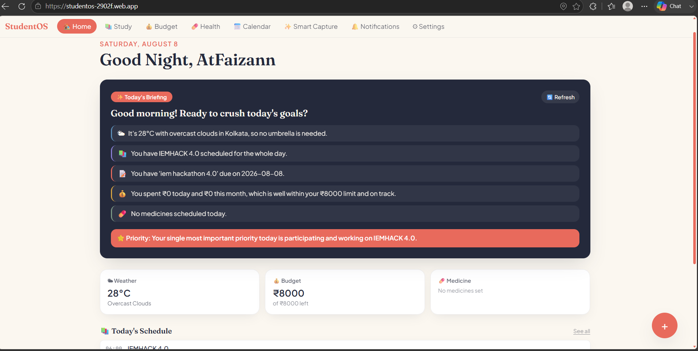
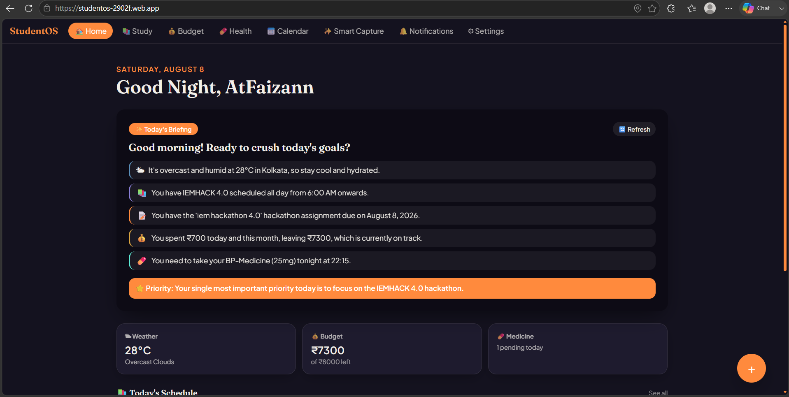
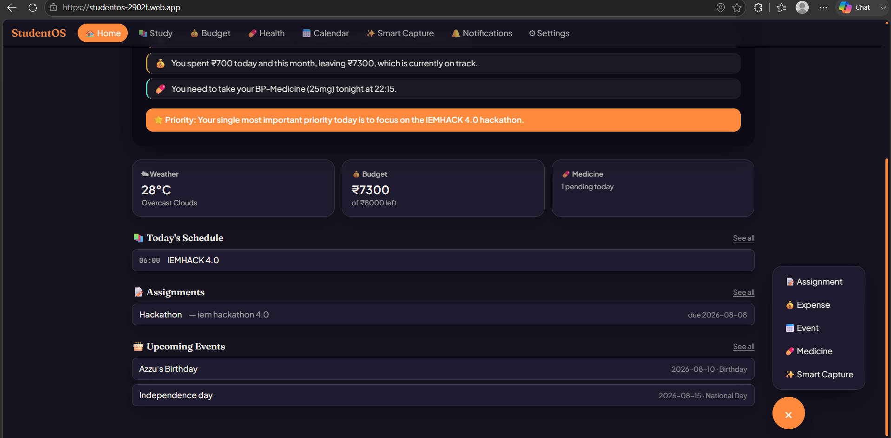

# StudentOS

StudentOS is an AI-powered daily dashboard for students — it centralizes classes, assignments, budget, medicines, and events into one place, and uses AI to tell you exactly what to prioritize today instead of making you piece it together yourself.

## Live Demo
https://studentos-2902f.web.app

## Tech Stack
- **Frontend:** React (Vite) + Tailwind CSS + Framer Motion
- **Backend:** Firebase (Authentication, Firestore, Hosting) — no separate server
- **AI:** Google Gemini API
- **Weather:** OpenWeather API

## Features
- 🔐 Google Sign-In authentication
- 📚 Timetable — weekly class schedule, add/edit/delete
- 📝 Assignments — track deadlines, mark complete
- 🗒 Notes — quick note-taking
- 💰 Budget — monthly budget tracking, expense logging by category, spend visualization
- 💊 Medicines — daily medicine reminders with taken/pending status
- 📅 Calendar/Events — upcoming events and important dates
- 🔔 Notifications — surfaces what needs attention (due assignments, pending medicines, upcoming events, budget alerts)
- 🌤 Live weather integration
- 🌙 Full dark mode
- ✨ AI Daily Briefing (see below)

## How AI Is Used
StudentOS's signature feature is the **AI Daily Briefing**. Every day, it pulls the student's real, live data from Firestore — today's classes, assignments due soon, current weather, budget remaining, and pending medicines — and sends it to Google's Gemini API, which generates a short, personalized summary of the day plus one clear recommended priority. The briefing is cached once per day so it feels instant on repeat visits, with a manual refresh option available anytime.

## Roadmap
- **Smart Capture (OCR):** upload a photo of a timetable, assignment notice, event poster, or medicine strip and have AI extract the details automatically for confirmation before saving. Intentionally left for after the hackathon MVP due to OCR's complexity and reliability risk in a short build window.
- Push notification support for reminders
- Google Calendar sync

## Screenshots

## Team
Built by FAIZAN ALKAMA and ADARSH KUMAR MISHRA for IEMHACKS 4.0.
